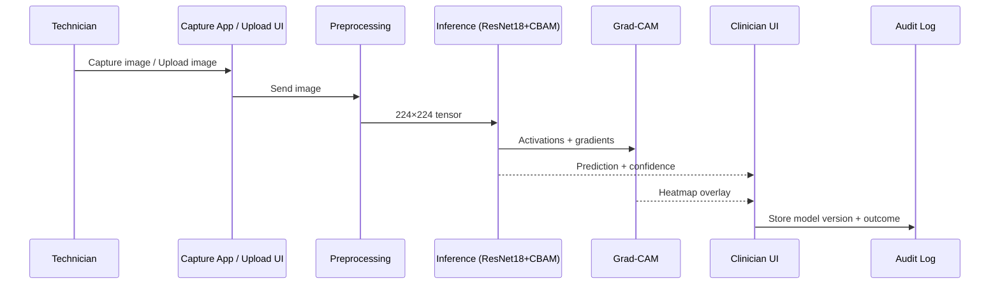

## AI-Based Cervical Cytology Screening System — Design Document

## 1. System Overview
This system performs AI‑assisted screening of cervical cytology images using
low‑resolution, smartphone‑compatible microscopy images. The model classifies
samples as **Normal** or **Abnormal** and provides **explainable heatmaps** to
support clinician interpretation and decentralized screening.

## 2. Problem Context
Cervical cancer remains a high‑burden yet preventable disease. Screening uptake
is limited due to:
- Low awareness and stigma
- Gender‑related discomfort during sampling
- Shortage of trained cytologists and lab infrastructure

AI‑assisted triage enables scalable preliminary screening in community settings.

## 3. Key Innovation
- Explainability‑first AI approach
- Robust performance on **low‑quality heterogeneous images**
- Designed for **screening support**, not replacement of clinicians
- Enables **low‑cost smartphone microscopy deployment**

## 4. System Architecture
The system supports low-cost cervical cytology screening using smartphone-compatible microscopy images, with
an explainability-first workflow that keeps clinicians in the loop.

### 4.1 High-level Architecture Diagram (Software Components)
```mermaid
flowchart LR
  A[Image Capture<br/>Smartphone + Microscope Adapter] --> B[Ingestion Layer<br/>Upload / Local Import]
  B --> C[Preprocessing Service<br/>Resize 224×224, Normalize]
  C --> D[Inference Service<br/>ResNet18 + CBAM]
  D --> E[Output Service<br/>Normal/Abnormal + Confidence]
  D --> F[Explainability Service<br/>Grad-CAM Heatmap]
  F --> G[Visualization Layer<br/>Overlay Heatmap on Image]
  E --> H[Clinician Review UI<br/>Triage Queue]
  G --> H
  H --> I[Decision & Reporting<br/>Flag / Refer / Re-check]
  I --> J[Audit & Logging<br/>Model Version, Inputs, Outcomes]

**Notes**
- The model is used for **screening/triage**: *Normal vs Abnormal*.
- **Confidence score** supports prioritizing uncertain cases.
- **Grad-CAM** overlays highlight regions influencing prediction (nucleus-centric regions are commonly emphasized).

### 4.2 Data Flow Diagram (DFD — Level 0)
```mermaid
flowchart TB
  subgraph External
    U[Operator / Technician]
    Cn[Clinician / Cytologist]
  end

  subgraph System[AI Screening System]
    P1((P1: Capture / Upload))
    P2((P2: Preprocess))
    P3((P3: Classify))
    P4((P4: Explain))
    P5((P5: Review & Report))
  end

  D1[(D1: Image Store)]
  D2[(D2: Model Store<br/>Weights + Version)]
  D3[(D3: Results Store<br/>Predictions + Confidence)]
  D4[(D4: Audit Log<br/>Inputs, Versions, Outcomes)]

  U -->|Microscopy image| P1
  P1 --> D1
  D1 --> P2
  P2 -->|Preprocessed tensor| P3
  D2 -->|Model weights| P3
  P3 -->|Label + confidence| D3
  P3 --> P4
  P4 -->|Heatmap overlay| D3
  D3 --> P5
  P5 -->|Case summary| Cn
  Cn -->|Decision (confirm/override)| P5
  P5 --> D4
```
**What our AI captures**
- Images are stored, transformed, and evaluated.
- Predictions + explanations are presented for clinician review.
- Decisions are logged for traceability and quality monitoring.

### 4.3 Optional Level-1 Data Flow (Inference Detail)



## 5. Core Modules

### 5.1 Input Module
- Loads cytology images via PyTorch DataLoader
- Batch size: 32

### 5.2 Preprocessing Module
- Resize to **224×224**
- Normalize and tensor conversion
- Device transfer (CPU/GPU)

### 5.3 CNN Classification Module
- Backbone: **ResNet18**
- Attention: **CBAM**
- Fully connected classifier + Softmax
- Binary output: Normal vs Abnormal
- Confidence score generation

### 5.4 Explainability Module
- **Grad‑CAM heatmap visualization**
- Highlights nucleus‑centric discriminative regions
- Improves clinician trust and transparency

## 6. Compression Robustness Strategy
Training and testing performed under:
- JPEG Quality **95**
- JPEG Quality **50**
- Mixed‑quality training for real‑world robustness

## 7. Deployment Vision
- Smartphone‑mounted microscopy
- Community health screening
- Triage before specialist review
- Low‑resource healthcare environments

## 8. Future Enhancements
- Pixel‑level segmentation of abnormal cells
- Multi‑cell slide‑level analysis
- Lightweight mobile architectures (e.g., MobileNet)
- Cloud‑based screening dashboards

## 9. Clinical Impact
This solution enables:
- Affordable large‑scale screening
- Early detection in underserved populations
- Reduced specialist workload
- Explainable AI‑supported diagnosis

